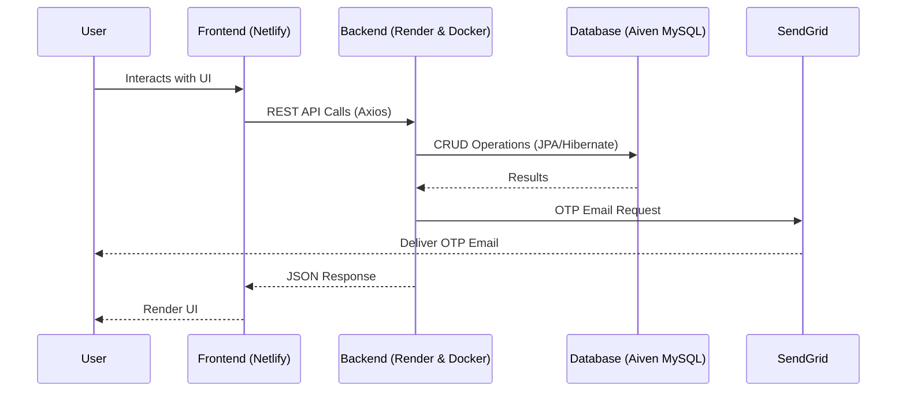

<div align="center">
  <!--  -->
  
  
  <br />

  # 💸 WalletWise

  **Your Intelligent Full-Stack Financial Management System**


  <p align="center">
    🌐 <b>Live Website:</b> <a href="https://walletwisefront.netlify.app/">https://walletwisefront.netlify.app/</a>
  </p>


  [](https://java.com/)
  [](https://spring.io/projects/spring-boot)
  [](https://dotnet.microsoft.com/)
  [](https://reactjs.org/)
  [](https://www.mysql.com/)
  [](https://www.docker.com/)

</div>

---

## 🌟 Project Overview

**WalletWise** is a comprehensive, production-grade financial management system built to bring clarity to personal finance. Whether you want to track daily expenses, manage loans, or get real-time investment data, WalletWise has got you covered! 

* 📉 **Track income and expenses** seamlessly
* 📈 **Manage investments and loans** effectively
* 📊 **View detailed financial dashboards** 
* 🔐 **Secure access** with OTP-based and JWT Authentication
* 💡 **Get real-time insights** into your financial health

---

## 🛠️ Tech Stack

### ⚙️ Backend
* **Java Spring Boot / .NET Backend** 
* **Spring Security** (JWT Authentication)
* **Hibernate / JPA / Entity Framework**
* **MySQL** (Aiven Cloud Managed Database)

### 🖥️ Frontend
* **React** (Vite Tooling for blazing fast performance)
* **Axios**
* **Tailwind CSS / Material UI** (Responsive styling)

### 🚢 Deployment & Infrastructure
* **Docker** (Multi-stage builds)
* **Render** (Backend deployment)
* **Netlify** (Frontend deployment)

### 🔌 External Services
* **SendGrid API** (Reliable Email OTP service)
* **Aiven** (Managed Cloud MySQL DB)

---

## 🏗️ Architecture Flow



* **Frontend** communicates with the **Backend** via secure REST APIs.
* **Backend** uses robust ORMs to manage data stored in a cloud-hosted **Aiven MySQL** database.
* **SendGrid API** handles crucial email-based OTP verification for high reliability.
* Everything is containerized using **Docker** and deployed reliably on **Render** (API) and **Netlify** (Client).

---

## ✨ Key Features

* **JWT Authentication:** Secure token-based user sessions.
* **OTP-based Verification:** Extra layer of trust during registration.
* **Smart Financial Dashboard:** At-a-glance reports of all funds.
* **Full CRUD capabilities:** Ease of use for Income, Expenses, Investments, and Loans.
* **Amortization Schedules:** Detailed loan calculation tables.
* **Real-time Market Integration:** Up-to-date data for smart investing.
* **Admin Tools:** Custom APIs for user administration and insights.

---

## 📸 Screenshots

<details>
<summary><b>1. Registration Page</b></summary>
<br>


</details>

<details>
<summary><b>2. Dashboard</b></summary>
<br>


</details>

<details>
<summary><b>3. Authentication & OTP Flow</b></summary>
<br>


</details>

<details>
<summary><b>4. Realtime Investments & Amortization</b></summary>
<br>


</details>

<details>
<summary><b>5. Deployment & Infrastructure</b></summary>
<br>

**Aiven MySQL Database Live:**


**Render Backend API Live:**


**Netlify Frontend Live:**

</details>

---

## 🚀 Deployment Flow

### ⚙️ Backend Deployment (Render + Docker)
1. **Create Dockerfile:** Utilizing a multi-stage Maven build for a lightweight image.
2. **Build JAR:** Compile the codebase entirely inside the container.
3. **Push to Registry:** The Docker image is pushed to Docker Hub.
4. **Deploy on Render:** Render easily spins up the Web Service pulling from Docker Hub.
5. **Configure Variables:** All secrets and URLs are attached via Render's safe Environment Variables.

### 🌐 Frontend Deployment (Netlify)
1. **Build Process:** Run `npm run build` using Vite.
2. **Upload Folder:** Publish the output `dist/` directory directly to Netlify.
3. **Configure Variables:** Add API URLs into Netlify’s environment settings.

---

## 🔧 Environment Variables

### Backend (`.env` / Render)
```ini
DATASOURCE_URL=jdbc:mysql://[host]:[port]/[database]
DATASOURCE_USER=your_db_username
DATASOURCE_PASSWORD=your_db_password
SENDGRID_API_KEY=SG.your_api_key_here
EMAIL_FROM=your_verified_sender@domain.com
```

### Frontend (`.env.production`)
```ini
VITE_API_BASE_URL=https://your-backend-api-url.onrender.com
```

---

## 💻 Setup Instructions (Local Development)

### ⚙️ Backend (Spring Boot / .NET)
1. Clone the repository: `git clone <repo-url>`
2. Configure your `application.properties` (or `appsettings.json`) with local/cloud DB details.
3. Run the application through your IDE or via terminal (e.g., `./mvnw spring-boot:run` or `dotnet run`).

### 🖥️ Frontend (React)
1. Navigate to the frontend directory.
2. Install dependencies:
   ```bash
   npm install
   ```
3. Start the dev server:
   ```bash
   npm run dev
   ```

---

## 📡 API Examples

### 🟢 `POST /api/auth/register`
Creates a new user and generates an OTP email.
```json
{
  "firstName": "John",
  "lastName": "Doe",
  "email": "john@example.com",
  "password": "securepassword123"
}
```

### 🟢 `POST /api/auth/login`
Authenticates a user and returns a JWT token.
```json
{
  "email": "john@example.com",
  "password": "securepassword123"
}
```

### 🔵 `GET /api/dashboard`
Fetches a user's combined financial dashboard stats. 

---

## 🛡️ Challenges Faced & Solutions

* **CORS Restrictions:** Met tight CORS policies during cloud deployment. Overcame this by precisely defining origin mappings across Gateway/Controllers.
* **SMTP Blocking on Render:** Render blocked standard SMTP ports (attempting standard JavaMail implementations). Engineered a pivot to the **SendGrid API** ensuring 100% email delivery.
* **Environment Configuration:** Properly staging different `.env` files for local vs. Docker vs. Render/Netlify builds.
* **Docker Multi-Stage Builds:** Ensuring the compiled image remains lightweight and doesn't carry unnecessary source code layers to production.

---

## 💡 Learnings

* The complete, end-to-end **Production Deployment Workflow** for modern Web Apps.
* Creating optimal **Docker Multi-stage Builds** for Java.
* Efficient **Cloud Database Integration** using Aiven.
* The nuances of handling **CORS & Application Security**.
* Integrating highly available **Third-party Email Services (SendGrid)**.

---

## 🔮 Future Improvements

- [ ] 📱 **Mobile App Version:** Launching parallel React Native mobile dashboards.
- [ ] 🤖 **AI Financial Assistant:** Pattern recognition for predicting expenses.
- [ ] 🔔 **Real-time Notifications:** Web sockets for market alerts.
- [ ] 👥 **Role-based Access Control:** Extending family/team account sharing mechanisms.

---

<div align="center">

## 👨‍💻 Author

**Mohammad Salik Mulla**  
*Full Stack Developer*

[](https://www.linkedin.com/in/salik-mulla)
[](https://github.com/salikongit)

<br/>
<p><i>Made with ❤️ and dedicated to building better software.</i></p>

</div>
